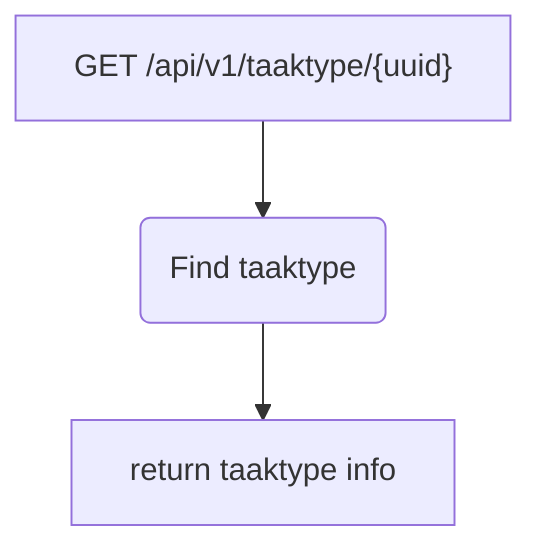

# Frank_GetTaakType

## Service Specification
| Description | Communication Pattern | Trigger | 
| --- | --- | --- | 
| Returns the requested taaktype. | Request-Response | Incoming HTTP request

## Detailed Specification

Upon receiving a request for getting a taaktype, this adapter will search through the list of available task types and
extract the taaktype that has an id which is equal to the uuid specified in the URL of the GET request.

The result is returned in a JSON format. This adapter does not expect an "Authorization" header.