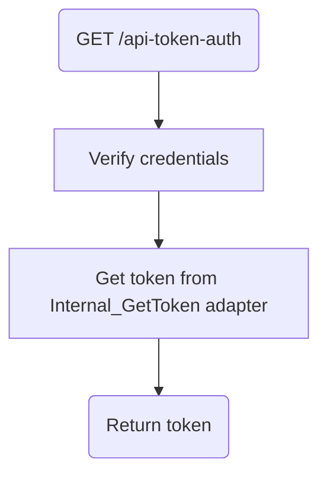

# Frank_GetToken

## Service Specification
| Description | Communication Pattern | Trigger | 
| --- | --- | --- | 
| If credentials are valid, returns token for communicating with the Frank. | Request-Response | Incoming HTTP request

## Detailed Specification

This adapter provides the client with a token. The token is automatically regenerated after a set amount of time. Any communication from Morcore to the Frank must include a "Authorization" header which contains this token.
Failure to provide a valid token will see the request be rejected.