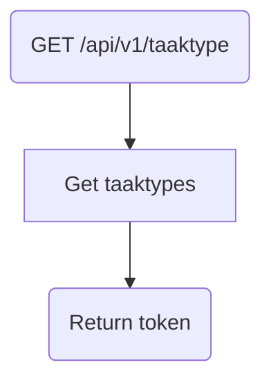

# Frank_ListTaakTypes

## Service Specification
| Description | Communication Pattern | Trigger | 
| --- | --- | --- | 
| Returns all taaktypes. | Request-Response | Incoming HTTP request

## Detailed Specification

This adapter returns all supported taaktypes as a JSON. This adapter does not expect an "Authorization" header.