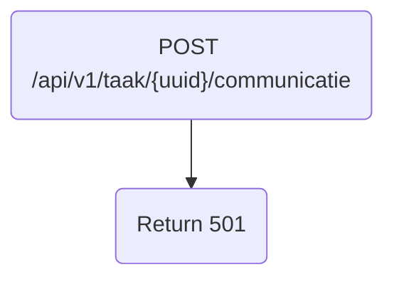

# Frank_PostCommunicatie

## Service Specification
| Description | Communication Pattern | Trigger | 
| --- | --- | --- | 
| Returns a 501. | Request-Response | Incoming HTTP request

## Detailed Specification

This adapter only returns a 501 and performs no other actions. This adapter does not expect an "Authorization" header.