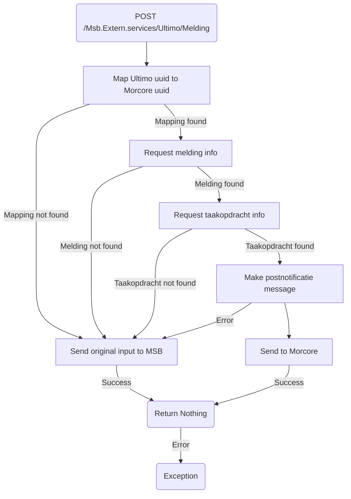

# Frank_PostNotificatie

## Service Specification
| Description | Communication Pattern | Trigger | 
| --- | --- | --- | 
| Inform Morcore that a Zaak in Ultimo has been changed. | Request-Response | Incoming HTTP request

### Data Model
No database is associated with actions performed by this adapter.

### Detailed Specification

When this adapter is called by Ultimo, the Frank will first check if a id mapping is present. If there is a mapping available for the incoming Ultimo id it will be transformed into the corresponding Morcore melding id. Using this Morcore melding id, the frank requests Morcore to return any information relating to the melding. Using the information returned by Morcore the Frank then accesses any information available about the taakopdracht related to the melding. If everything has succeeded so far, a postnotificatie message is created and sent to Morcore.
If an error occurs at any stage of this adapter the fallback system will take over and instead send a postnotificatie message to MSB.

This adapter expects two auth headers: ApiKey and ApplicationElementId.

### Message Specification
The OpenAPI specification for this adapter is available [here](https://ultimo-koppeling-acc.forzamor.nl/iaf/api/webservices/openapi.json?uri=/Msb.Extern.services/Ultimo/Melding).

### Trigger Specification
This adapter is triggered each time the HttpListener within the adapter receives a message.

## Data Mappings
The Data Mappings section will list all data transformations that are of importance to the current adapter, if any.
### PostNotificatieRequest.xsl
| **XML Field**| **Mapped JSON Field**| **Transformation**|
|--------------|----------------------|-------------------|
| `//status` | `taakstatus.naam` | `if status = 'Nieuw', 'Gemeld', 'In behandeling', or 'Vertraging' -> 'nieuw'` `if status = 'Afgewezen', 'NietOpTeLossen', or 'Afgehandeld' -> 'voltooid'` `else -> 'onbekend'` |
| `//status` | `resolutie`| `if status = 'Afgewezen' or 'NietOpTeLossen' -> 'niet_opgelost'` `if status = 'Afgehandeld' -> 'opgelost'` `else -> null` |
| `//Opmerking`| `omschrijving_intern`| `Direct value-of`|
| `//Behandelaar`| `gebruiker`| `Direct value-of`|
| N/A| `bijlagen`| `[] (empty array)`|
| N/A| `resolutie_opgelost_herzien`| `false (constant)`|