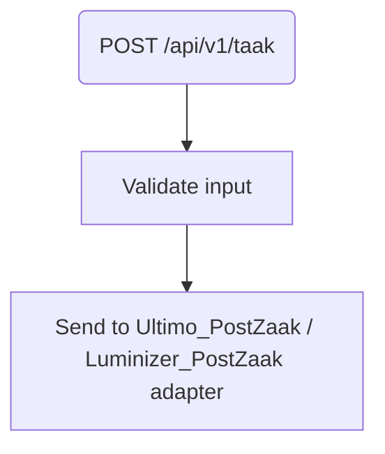

# Frank_PostTaak

## Service Specification
| Description | Communication Pattern | Trigger | 
| --- | --- | --- | 
| Begin posting a Zaak. | Request-Response | Incoming HTTP request

## Detailed Specification

This adapter is used for starting a PostZaak call towards Luminizer or Ultimo. This adapter only performs input validation and routing. This adapter expects an "Authorization" header.