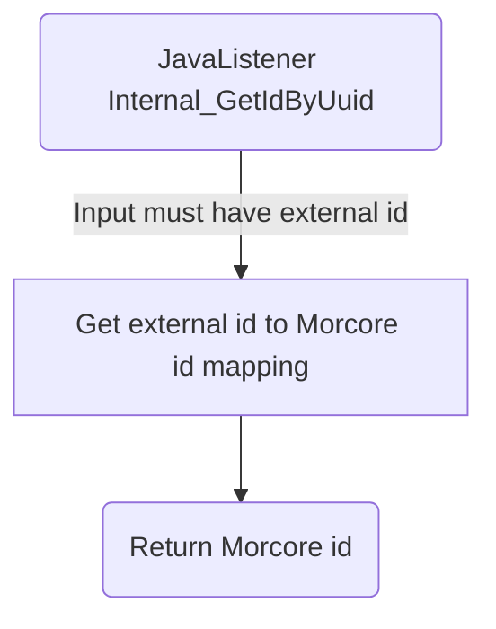

# Internal_GetIdByUuid

## Service Specification
| Description | Communication Pattern | Trigger | 
| --- | --- | --- | 
| Use an external system's zaak id to get a Morcore melding id. | Request-Response | Call to JavaListener

## Detailed Specification

This is an internal adapter that retrieves a Morcore melding uuid based on an external id.