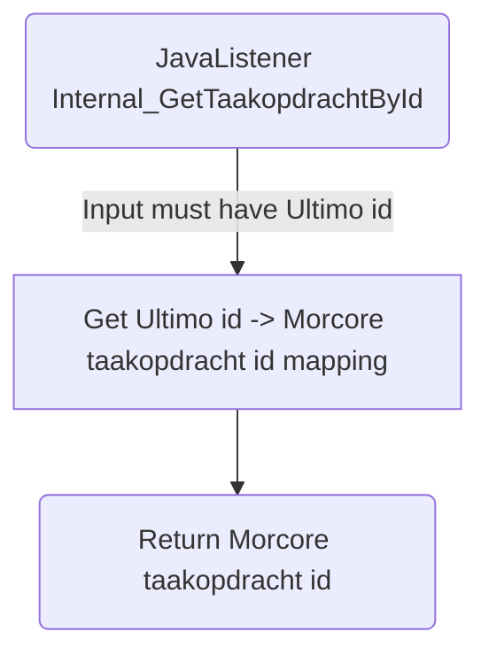

# Internal_GetTaakopdrachtById

```mermaid
flowchart TD
    A(JavaListener Internal_GetTaakopdrachtById) -->|Input must have Ultimo id| B[Get Ultimo id -> Morcore taakopdracht id mapping]
    B --> C(Return Morcore taakopdracht id)
```