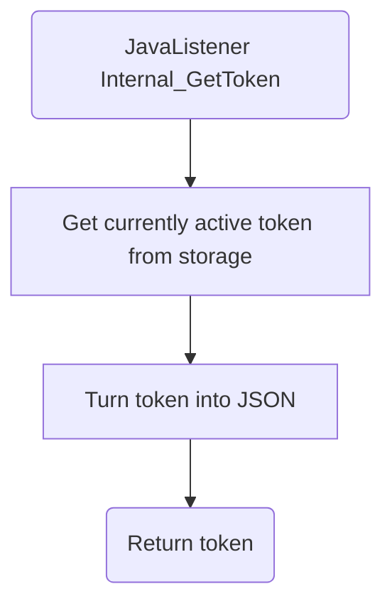

# Internal_GetToken

## Service Specification
| Description | Communication Pattern | Trigger | 
| --- | --- | --- | 
| Retrieve currently active Frank token. | Request-Response | Call to JavaListener

## Detailed Specification

This adapter only returns the currently active Frank token and does not perform any other action.