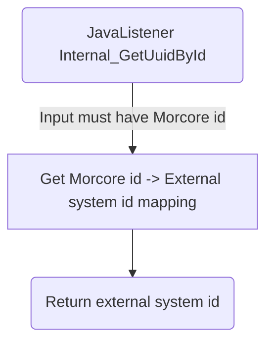

# Internal_GetUuidById

## Service Specification
| Description | Communication Pattern | Trigger | 
| --- | --- | --- | 
| Use a Morcore id to get an external system's Zaak id. | Request-Response | Call to JavaListener

## Detailed Specification

Based on the input Morcore melding uuid, this adapter will return an external system's zaak id.