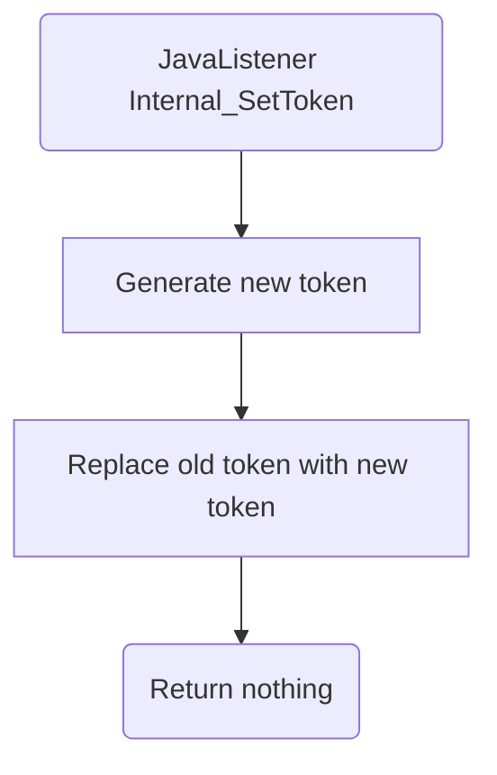

# Internal_SetToken

# Service Specification
| Description | Communication Pattern | Trigger | 
| --- | --- | --- | 
| Regenerate the currently active Frank token. | Fire-and-Forget | Call to JavaListener

## Detailed Specification

A job automatically calls this adapter every so often. When called, this adapter generates a new token and replaces the old one in the database.