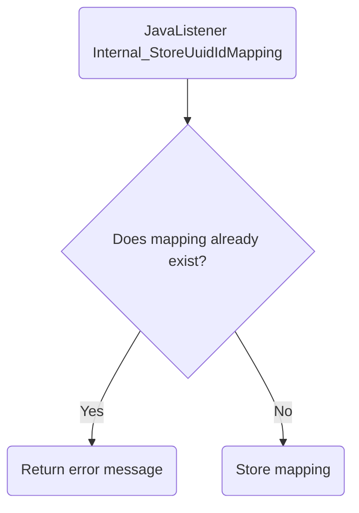

# Internal_StoreUuidIdMapping

## Service Specification
| Description | Communication Pattern | Trigger | 
| --- | --- | --- | 
| Store the data needed to map between Morcore ids and external system ids. | Request-Response | Call to JavaListener

## Detailed Specification

This adapter can be used to create a new mapping between a Morcore melding uuid, a Morcore taakopdracht id and an external system's zaak uuid.