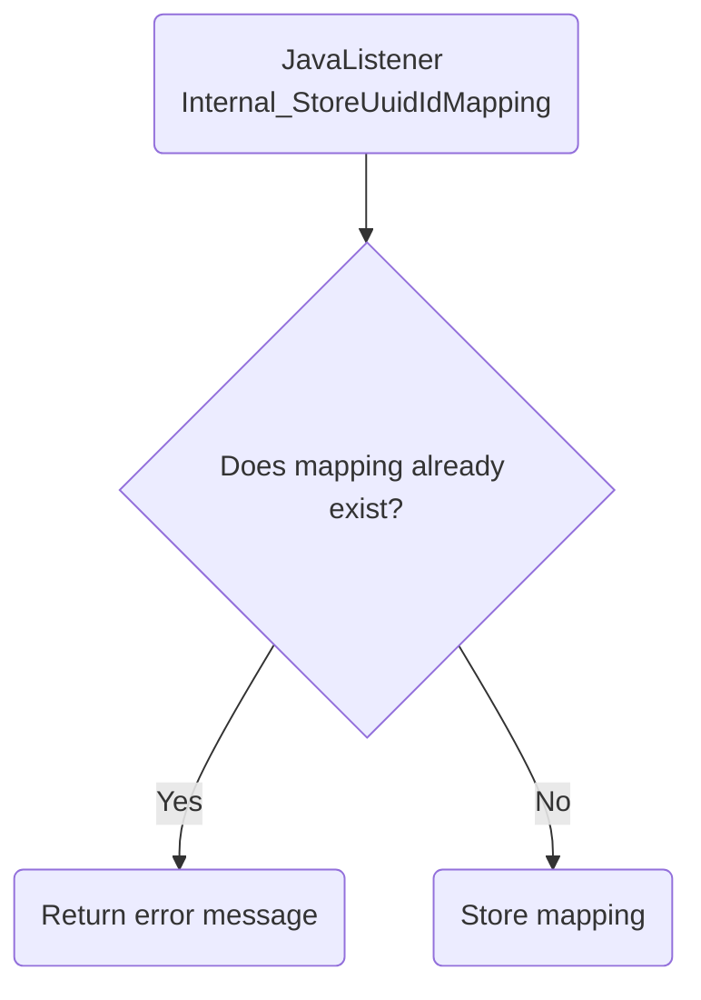

# Internal_StoreUuidIdMapping

```mermaid
flowchart TD
    A(JavaListener Internal_StoreUuidIdMapping) -->B{Does mapping already exist?}
    B -->|Yes| C(Return error message)
    B -->|No| D(Store mapping)
```