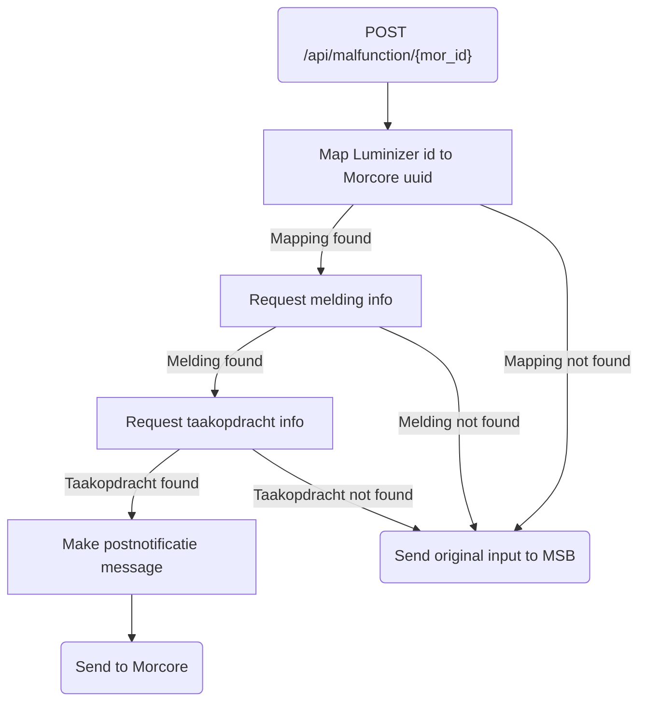

# Luminizer_PostNotificatie

```mermaid
flowchart TD
    A("POST /api/malfunction/{mor_id}") --> B[Map Luminizer id to Morcore uuid]
    B -->|Mapping found| C[Request melding info]
    C -->|Melding found| D[Request taakopdracht info]
    D -->|Taakopdracht found| E[Make postnotificatie message]
    E --> F(Send to Morcore)
    
    G(Send original input to MSB)
    B -->|Mapping not found| G
    C -->|Melding not found| G
    D -->|Taakopdracht not found| G
```