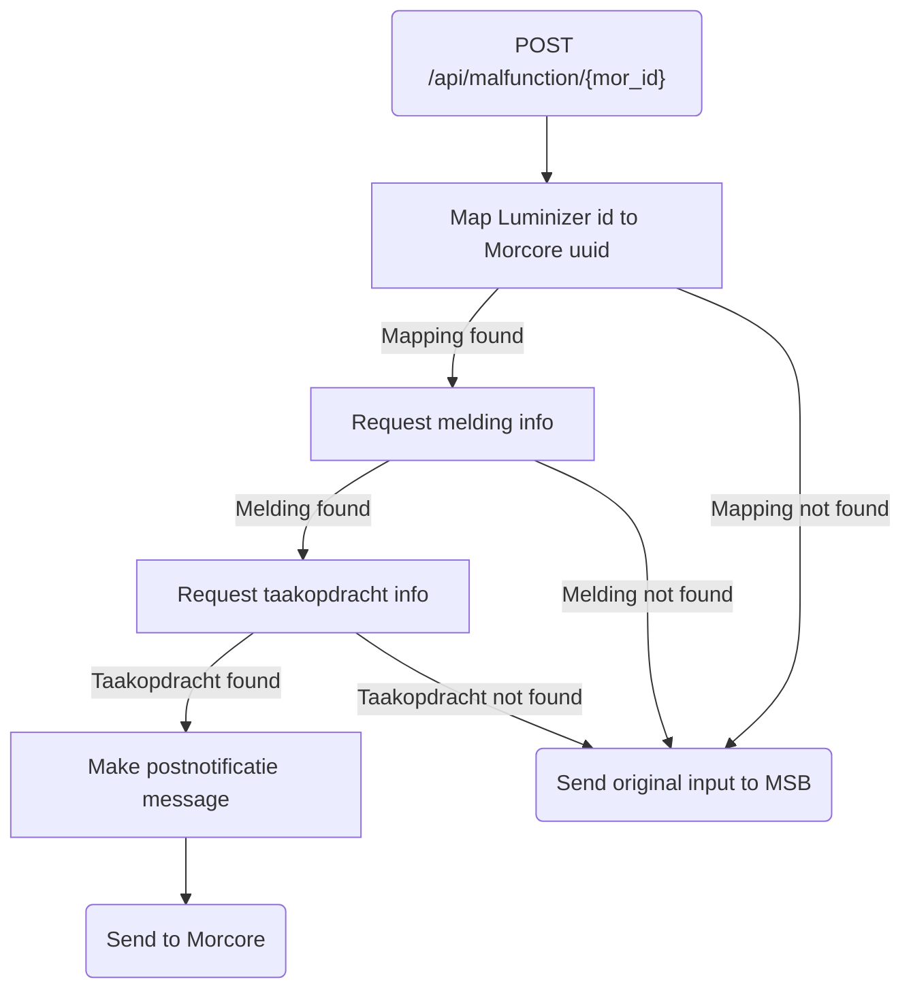

# Luminizer_PostNotificatie

## Service Specification
| Description | Communication Pattern | Trigger | 
| --- | --- | --- | 
| Inform Morcore that a zaak has changed in Luminizer. | Request-Response | Incoming HTTP request

## Detailed Specification

This adapter receives a message from Luminizer whenever a Luminizer zaak has been updated. The adapter then sends a notification to Morcore about the change.