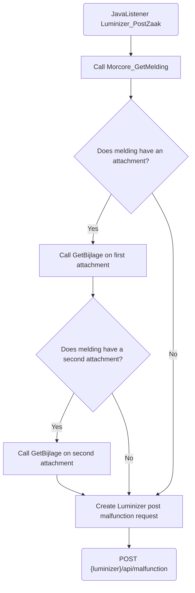

# Luminizer_PostZaak

```mermaid
flowchart TD
    A(JavaListener Luminizer_PostZaak) --> B[Call Morcore_GetMelding]
    B --> C{Does melding have an attachment?}
    C --> |Yes| D[Call GetBijlage on first attachment]
    D --> E{Does melding have a second attachment?}
    E --> |Yes| F[Call GetBijlage on second attachment]
    F --> G[Create Luminizer post malfunction request]
    G --> H("POST {luminizer}/api/malfunction")

    C --> |No| G
    E --> |No| G
```