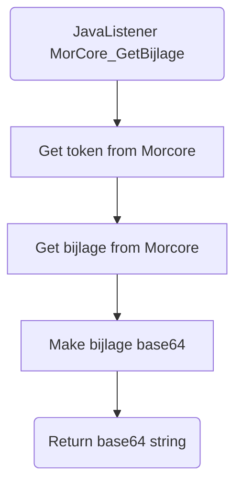

# MorCore_GetBijlage

## Service Specification
| Description | Communication Pattern | Trigger | 
| --- | --- | --- | 
| Request Morcore data for a file. | Request-Response | Call to JavaListener

## Detailed Specification

This adapter is used for retrieving an attachment as a base64 string. By requesting the file data from Morcore, the Frank can then perform the base64 conversion and return it as the result of the adapter.