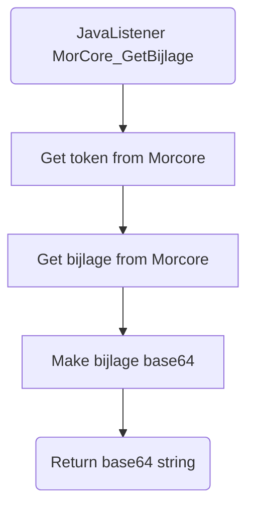

# MorCore_GetBijlage

```mermaid
flowchart TD
    A(JavaListener MorCore_GetBijlage) -->B[Get token from Morcore]
    B --> C[Get bijlage from Morcore]
    C --> D[Make bijlage base64]
    D --> E(Return base64 string)
```