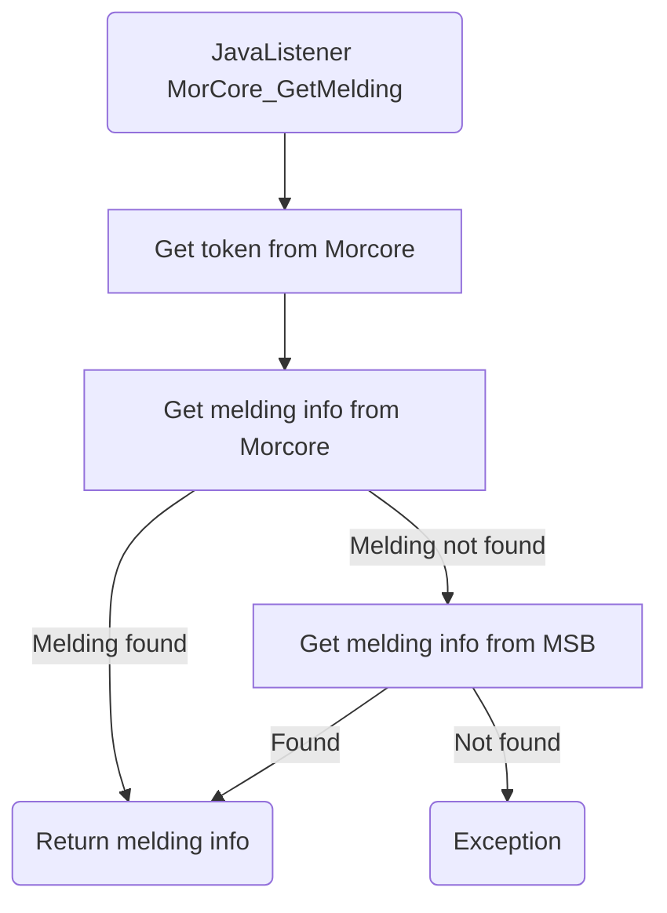

# MorCore_GetMelding

```mermaid
flowchart TD
    A(JavaListener MorCore_GetMelding) -->B[Get token from Morcore]
    B --> C[Get melding info from Morcore]
    C --> |Melding found| D(Return melding info)
    C --> |Melding not found| E[Get melding info from MSB]
    E --> |Found| D
    E --> |Not found|F(Exception)
```