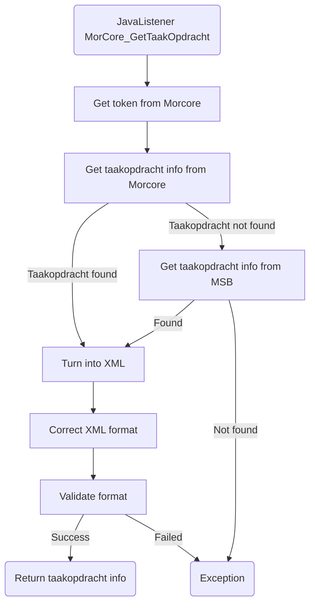

# MorCore_GetTaakOpdracht

## Service Specification
| Description | Communication Pattern | Trigger | 
| --- | --- | --- | 
| Request available information for a taakopdracht stored in Morcore. | Request-Response | Call to JavaListener

## Detailed Specification

This adapter sends a request to Morcore for all information about a specific taakopdracht stored in Morcore. 