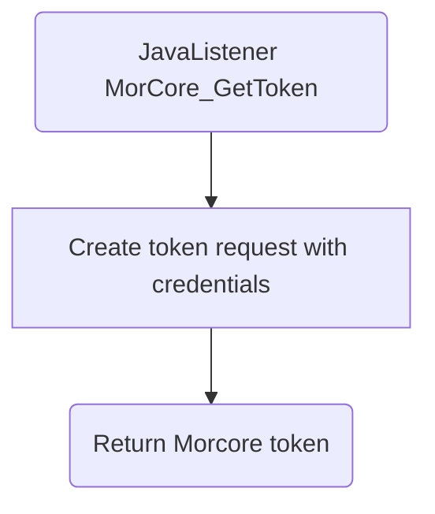

# MorCore_GetToken

## Service Specification
| Description | Communication Pattern | Trigger | 
| --- | --- | --- | 
| Request a token necessary for communication with Morcore. | Request-Response | Call to JavaListener

## Detailed Specification

This adapter uses the authorization information set on the deployment to send a request to Morcore. The request, if the credentials are valid, will return a token that can be used for other communication towards Morcore.