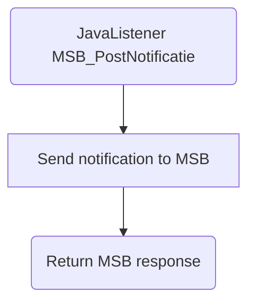

# MSB_PostNotificatie

## Service Specification
| Description | Communication Pattern | Trigger | 
| --- | --- | --- | 
| Inform MSB that a Zaak has been changed in an external system. | Request-Response | Call to JavaListener

## Detailed Specification

Using this adapter allows the Frank to notify MSB that a specific zaak has been updated in an external system.