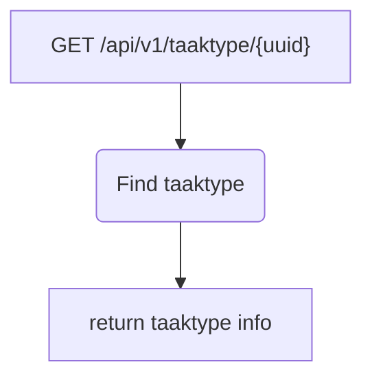

# Frank_GetTaakType

## Service Specification
| Description | Communication Pattern | Trigger | 
| --- | --- | --- | 
| Returns the requested taaktype. | Request-Response | Incoming HTTP request

### Data Model
No database is associated with actions performed by this adapter.

### Detailed Specification

Upon receiving a request for getting a taaktype, this adapter will search through the list of available task types and
extract the taaktype that has an id which is equal to the uuid specified in the URL of the GET request.

The result is returned in a JSON format. This adapter does not expect an "Authorization" header.

### Message Specification
The OpenAPI specification for this adapter is available [here](https://ultimo-koppeling-acc.forzamor.nl/iaf/api/webservices/openapi.json?uri=/api/v1/taaktype/%7Buuid%7D).

### Trigger Specification
This adapter is triggered each time the HttpListener within the adapter receives a message.

## Data Mappings
The Data Mappings section will list all data transformations that are of importance to the current adapter, if any.