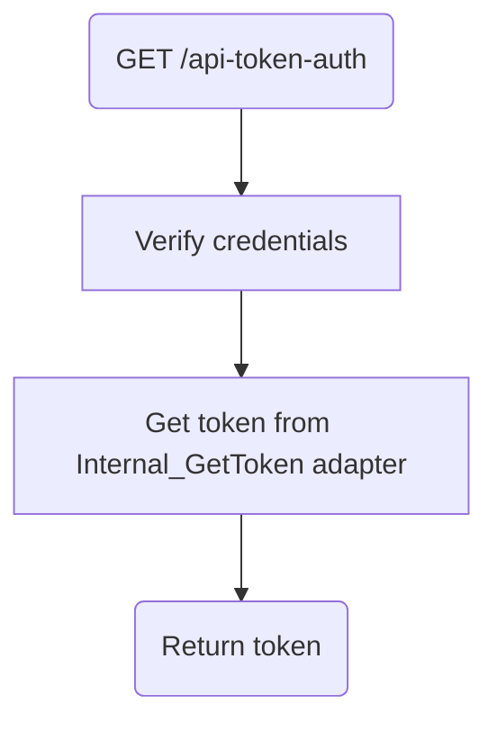

# Frank_GetToken

## Service Specification
| Description | Communication Pattern | Trigger | 
| --- | --- | --- | 
| If credentials are valid, returns token for communicating with the Frank. | Request-Response | Incoming HTTP request

### Data Model
No database is associated with actions performed by this adapter.

### Detailed Specification

This adapter provides the client with a token. The token is automatically regenerated after a set amount of time. Any communication from Morcore to the Frank must include a "Authorization" header which contains this token.
Failure to provide a valid token will see the request be rejected.

### Message Specification
The OpenAPI specification for this adapter is available [here](https://ultimo-koppeling-acc.forzamor.nl/iaf/api/webservices/openapi.json?uri=/api-token-auth).

### Trigger Specification
This adapter is triggered each time the HttpListener within the adapter receives a message.

## Data Mappings
The Data Mappings section will list all data transformations that are of importance to the current adapter, if any.