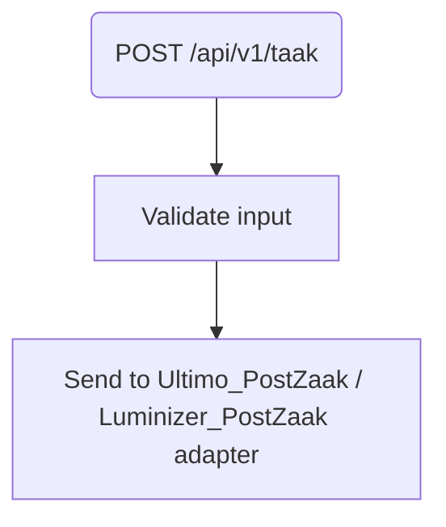

# Frank_PostTaak

## Service Specification
| Description | Communication Pattern | Trigger | 
| --- | --- | --- | 
| Begin posting a Zaak. | Request-Response | Incoming HTTP request

### Data Model
No database is associated with actions performed by this adapter.

### Detailed Specification

This adapter is used for starting a PostZaak call towards Luminizer or Ultimo. This adapter only performs input validation and routing. This adapter expects an "Authorization" header.

### Message Specification
The OpenAPI specification for this adapter is available [here](https://ultimo-koppeling-acc.forzamor.nl/iaf/api/webservices/openapi.json?uri=/api/v1/taak).

### Trigger Specification
This adapter is triggered each time the HttpListener within the adapter receives a message.

## Data Mappings
The Data Mappings section will list all data transformations that are of importance to the current adapter, if any.