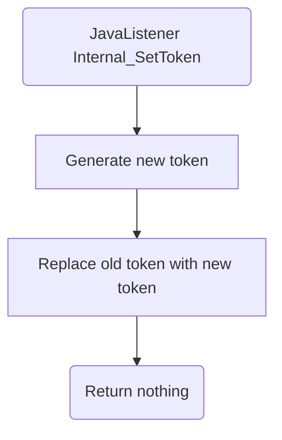

# Internal_SetToken

# Service Specification
| Description | Communication Pattern | Trigger | 
| --- | --- | --- | 
| Regenerate the currently active Frank token. | Fire-and-Forget | Call to JavaListener

### Data Model
The following table(s) is/are associated with actions performed by this adapter.

#### TOKENSTORE Table

| **Column Name**  | **Data Type**   | **Constraints** | **Description** |
| --- | --- | --- | --- |
| `id` | `int`| None| Database entry id. |
| `token` | `varchar(255)` | None | A token represented as a string. |

### Detailed Specification

A job automatically calls this adapter every so often. When called, this adapter generates a new token and replaces the old one in the database.

### Trigger Specification
This adapter is triggered each time the JavaListener within the adapter receives a message.

## Data Mappings
The Data Mappings section will list all data transformations that are of importance to the current adapter, if any.