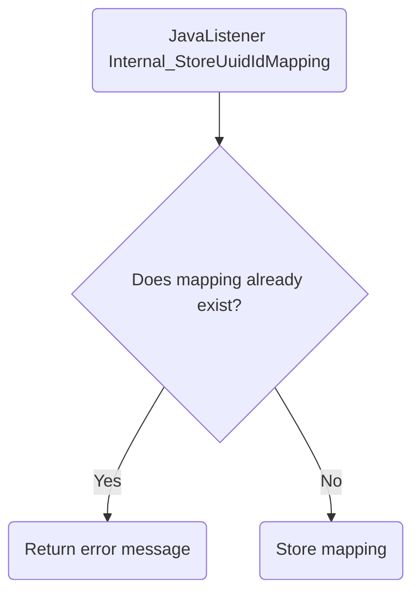

# Internal_StoreUuidIdMapping

## Service Specification
| Description | Communication Pattern | Trigger | 
| --- | --- | --- | 
| Store the data needed to map between Morcore ids and external system ids. | Request-Response | Call to JavaListener

### Data Model
The following table(s) is/are associated with actions performed by this adapter.

#### UUIDIDMAP Table

| **Column Name** | **Data Type** | **Constraints** | **Description** |
| --- | --- | --- | --- |
| `id` | `int` | `unique` (`UK_UUIDIDMAP_ID`) | Zaak id for external system. |
| `uuid` | `varchar(255)` | `primary key` (`PK_UUIDIDMAP`), `not null` | Melding id for Morcore. |
| `taakopdracht` | `varchar(255)` | `not null` | Taakopdracht id for Morcore. |

### Detailed Specification

This adapter can be used to create a new mapping between a Morcore melding uuid, a Morcore taakopdracht id and an external system's zaak uuid.

### Trigger Specification
This adapter is triggered each time the JavaListener within the adapter receives a message.

## Data Mappings
The Data Mappings section will list all data transformations that are of importance to the current adapter, if any.