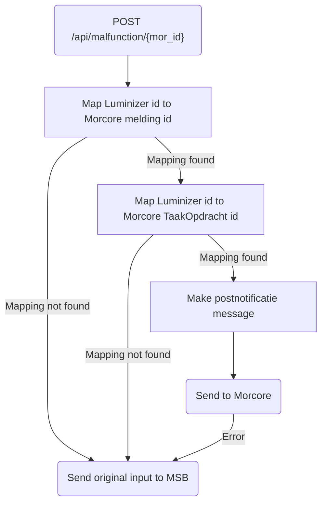

# Luminizer_PostNotificatie

## Service Specification
| Description | Communication Pattern | Trigger | 
| --- | --- | --- | 
| Inform Morcore that a zaak has changed in Luminizer. | Request-Response | Incoming HTTP request

### Data Model
No database is associated with actions performed by this adapter.

### Detailed Specification

This adapter receives a message from Luminizer whenever a Luminizer zaak has been updated. After obtaining a Morcore melding id, the adapter proceeds to request information relating to  The adapter then sends a notification to Morcore about the change.

### Trigger Specification
This adapter is triggered each time the HttpListener within the adapter receives a message.

## Data Mappings
The Data Mappings section will list all data transformations that are of importance to the current adapter, if any.
### PostNotificatieRequest.xsl
| **XML Field**| **Mapped JSON Field**| **Transformation**|
|--------------|----------------------|-------------------|
| `//status` | `taakstatus.naam` | `if status = 'Nieuw', 'Gemeld', 'In behandeling', or 'Vertraging' -> 'nieuw'` `if status = 'Afgewezen', 'NietOpTeLossen', or 'Afgehandeld' -> 'voltooid'` `else -> 'onbekend'` |
| `//status` | `resolutie`| `if status = 'Afgewezen' or 'NietOpTeLossen' -> 'niet_opgelost'` `if status = 'Afgehandeld' -> 'opgelost'` `else -> null` |
| `//Opmerking`| `omschrijving_intern`| `Direct value-of`|
| `//Behandelaar`| `gebruiker`| `Direct value-of`|
| N/A| `bijlagen`| `[] (empty array)`|
| N/A| `resolutie_opgelost_herzien`| `false (constant)`|