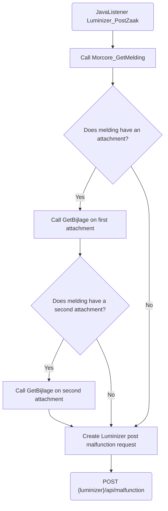

# Luminizer_PostZaak

## Service Specification
| Description | Communication Pattern | Trigger | 
| --- | --- | --- | 
| Post a zaak in Luminizer. | Request-Response | Call to JavaListener

### Data Model
No database is associated with actions performed by this adapter.

### Detailed Specification

This adapter is used for posting a zaak in Luminizer. Morcore_GetMelding is called to retrieve information needed for posting the zaak. Up to two attachments stored within the Morcore melding will be included in the postzaak request to Luminizer.

### Trigger Specification
This adapter is triggered each time the JavaListener within the adapter receives a message.

## Data Mappings
The Data Mappings section will list all data transformations that are of importance to the current adapter, if any.