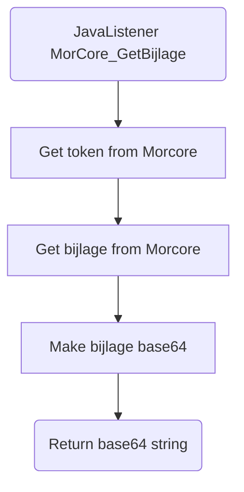

# MorCore_GetBijlage

## Service Specification
| Description | Communication Pattern | Trigger | 
| --- | --- | --- | 
| Request Morcore data for a file. | Request-Response | Call to JavaListener

### Data Model
No database is associated with actions performed by this adapter.

### Detailed Specification

This adapter is used for retrieving an attachment as a base64 string. By requesting the file data from Morcore, the Frank can then perform the base64 conversion and return it as the result of the adapter.

### Trigger Specification
This adapter is triggered each time the JavaListener within the adapter receives a message.

## Data Mappings
The Data Mappings section will list all data transformations that are of importance to the current adapter, if any.