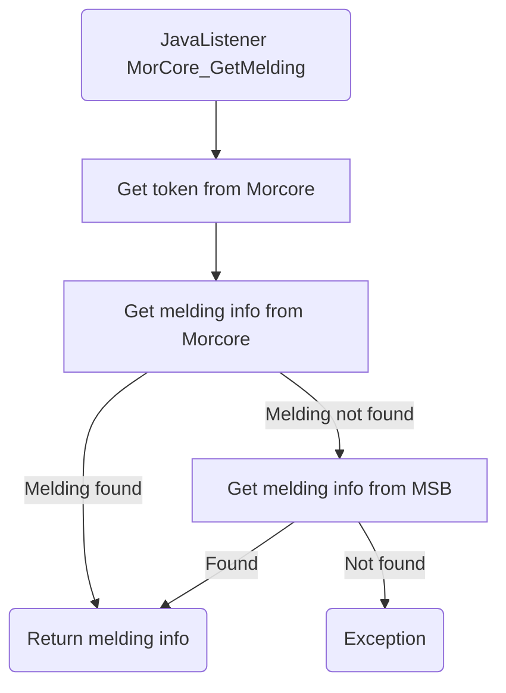

# MorCore_GetMelding

## Service Specification
| Description | Communication Pattern | Trigger | 
| --- | --- | --- | 
| Request available information for a melding in Morcore. | Request-Response | Call to JavaListener

### Data Model
No database is associated with actions performed by this adapter.

### Detailed Specification

This adapter sends a request to Morcore for all information about a specific melding stored in Morcore. 

### Trigger Specification
This adapter is triggered each time the JavaListener within the adapter receives a message.

## Data Mappings
The Data Mappings section will list all data transformations that are of importance to the current adapter, if any.