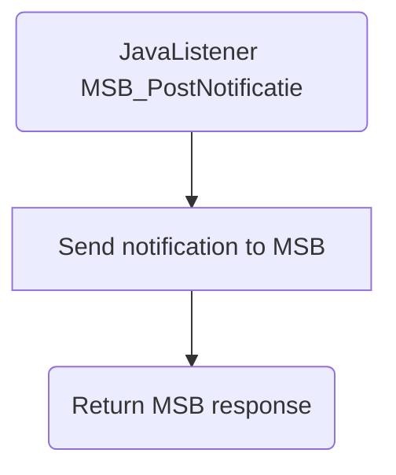

# MSB_PostNotificatie

## Service Specification
| Description | Communication Pattern | Trigger | 
| --- | --- | --- | 
| Inform MSB that a Zaak has been changed in an external system. | Request-Response | Call to JavaListener

### Data Model
No database is associated with actions performed by this adapter.

### Detailed Specification

Using this adapter allows the Frank to notify MSB that a specific zaak has been updated in an external system.

### Trigger Specification
This adapter is triggered each time the JavaListener within the adapter receives a message.

## Data Mappings
The Data Mappings section will list all data transformations that are of importance to the current adapter, if any.